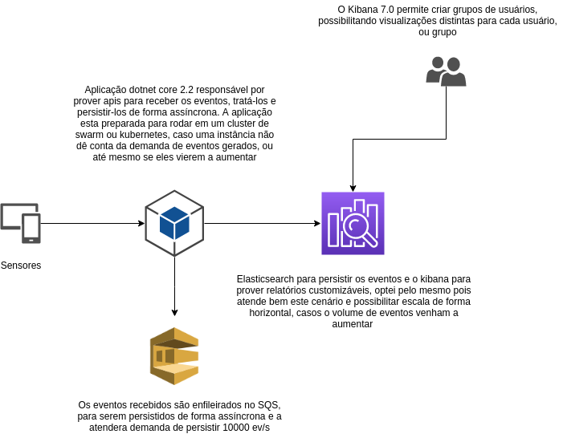

# Solução desenvolvida


## Exemplo de requisição

[Documentação swagger](https://localhost:5001/swagger/index.html)

#### Requisição responsável por enviar os eventos

```sh
curl -X POST \
  http://localhost:5000/v1/event-receivers \
  -H 'Content-Type: application/json' \
  -d '{
    "timestamp": 1539112021,
    "tag": "brasil.sudeste.sensor01",
    "valor": "912391232193912"
}'
```

## Rodar aplicação

### Construir container

```sh
sudo docker build . --tag=adrianolaselva/analyst-challenge:0.0.1
```

### Rodar projeto

```sh
sudo docker run -it -p 5005:80 adrianolaselva/analyst-challenge:0.0.1 \
-e AWS_ACCESS_KEY= \
-e AWS_SECRET_KEY= \
-e AWS_SQS_QUEUE_URL_EVENT_RECEIVER=https://sqs.us-east-1.amazonaws.com/123123213121/queue-event-receiver \
-e ELASTICSEARCH_URL=http://localhost:9200/ \
-e ELASTICSEARCH_INDEX=iot-receive
```

### Rodar Stack completa para testes

```sh
sudo docker-compose up --build
```

### Desenho da solução


